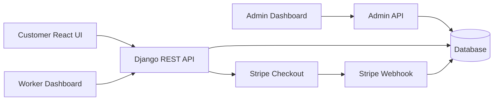

# 🏠 Home Service

A full-stack home services marketplace connecting customers with skilled workers — plumbers, electricians, cleaners, and more. Customers can browse, book, and pay for services, while workers manage their profiles, listings, and job status. A JWT-protected super-admin dashboard oversees the entire platform.

<p align="left">
  
  
  
  
  
</p>

---

## ✨ Features

**Customers**
- Register and manage a personal profile
- Browse workers filtered by profession
- Book a service and pay via **Stripe Checkout**, or choose to pay later
- Track booking status and rate completed work

**Workers**
- Manage profile and offered services
- View and respond to incoming bookings
- Update job/booking status as work progresses

**Admin**
- JWT-protected super-admin dashboard
- Manage users, workers, bookings, services, and payments in one place

---

## 🧱 Tech Stack

| Layer      | Technology |
|------------|------------|
| Backend    | Django, Django REST Framework, Simple JWT |
| Database   | SQLite (local dev), PostgreSQL-ready via `DATABASE_URL` |
| Frontend   | React, React Router, Tailwind CSS, Heroicons |
| Payments   | Stripe Checkout + webhook handling |
| Quality    | Django API test suite, CRA test runner, GitHub Actions CI |

---

## 🏗️ Architecture



---

## 🚀 Getting Started

### Prerequisites
- Python 3.10+
- Node.js 18+
- npm

### 1. Backend Setup

```bash
cd back-end
cp .env.example .env
python3 -m venv .venv
source .venv/bin/activate
pip install -r requirements.txt
python manage.py migrate
python manage.py runserver
```

The API will be available at `http://localhost:8000`.

### 2. Frontend Setup

```bash
cd front-end/homefront
cp .env.example .env
npm install
npm start
```

The app will be available at `http://localhost:3000`.

> Update the `.env` files with your own Stripe keys, database URL, and JWT secrets before running in a real environment.

---

## ✅ Testing & Build

**Backend tests**
```bash
cd back-end
python manage.py test HomeApp
```

**Frontend tests & production build**
```bash
cd front-end/homefront
npm test -- --watchAll=false
npm run build
```

CI runs these checks automatically on every push via **GitHub Actions**.

---

## 📦 Deployment

| Resource | Link |
|---|---|
| Deployment Guide | [DEPLOYMENT_GUIDE.md](DEPLOYMENT_GUIDE.md) |
| Security Checklist | [SECURITY_CHECKLIST.md](SECURITY_CHECKLIST.md) |
| Backend env template | [back-end/.env.example](back-end/.env.example) |
| Frontend env template | [front-end/homefront/.env.example](front-end/homefront/.env.example) |

> 🔗 **Live demo & screenshots** — coming soon, once the Django API and React frontend are deployed.

---

## 🗺️ Project Structure

```
Home-client-worker/
├── back-end/                 # Django REST API
│   └── HomeApp/               # Core app: users, workers, bookings, payments
├── front-end/
│   └── homefront/             # React client (customer, worker, admin views)
├── DEPLOYMENT_GUIDE.md
├── SECURITY_CHECKLIST.md
└── README.md
```

---

## 🤝 Contributing

Contributions, issues, and feature requests are welcome. Feel free to open an issue or submit a pull request.

## 📄 License

This project is open source. Add your preferred license (e.g. MIT) here.
