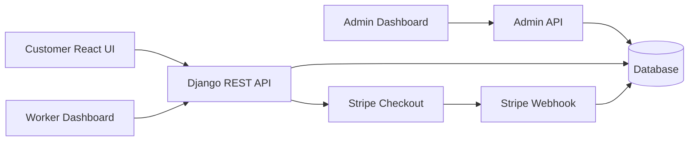

# Home Service

A full-stack home services marketplace where customers can register, browse workers by profession, book a service, pay now with Stripe or pay later, manage profile details, and rate completed work. Workers can manage their profile, services, bookings, and booking status. The project also includes a JWT-protected super-admin dashboard for users, workers, bookings, services, and payments.

## Tech Stack

- Backend: Django, Django REST Framework, Simple JWT, SQLite for local development, PostgreSQL-ready via `DATABASE_URL`
- Frontend: React, React Router, Tailwind CSS, Heroicons
- Payments: Stripe Checkout and webhook handling
- Quality: Django API tests, CRA test runner, GitHub Actions CI

## Architecture



## Local Setup

1. Backend:

```bash
cd back-end
cp .env.example .env
python3 -m venv .venv
source .venv/bin/activate
pip install -r requirements.txt
python manage.py migrate
python manage.py runserver
```

1. Frontend:

```bash
cd front-end/homefront
cp .env.example .env
npm install
npm start
```

## Test And Build

```bash
cd back-end
python manage.py test HomeApp
```

```bash
cd front-end/homefront
npm test -- --watchAll=false
npm run build
```

## Deployment

- Deployment guide: [DEPLOYMENT_GUIDE.md](DEPLOYMENT_GUIDE.md)
- Security checklist: [SECURITY_CHECKLIST.md](SECURITY_CHECKLIST.md)
- Environment templates: [back-end/.env.example](back-end/.env.example), [front-end/homefront/.env.example](front-end/homefront/.env.example)

Live demo and screenshots should be added here after deploying the Django API and React frontend.
